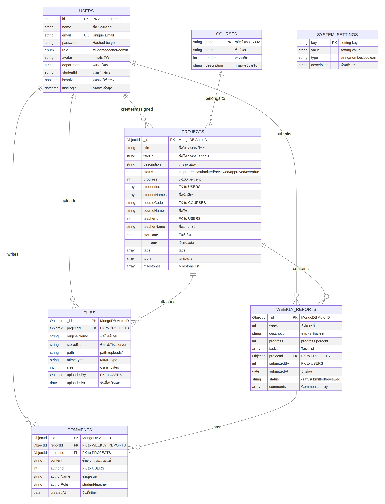
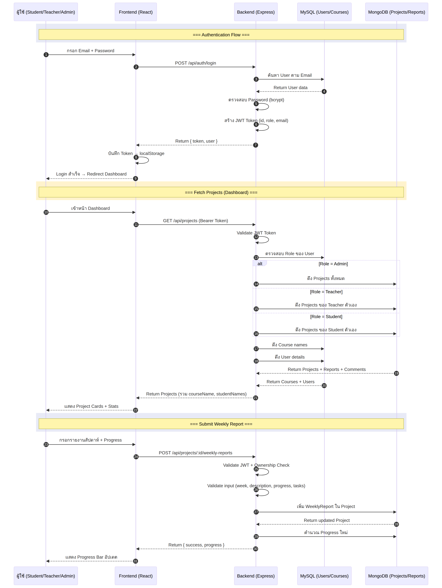
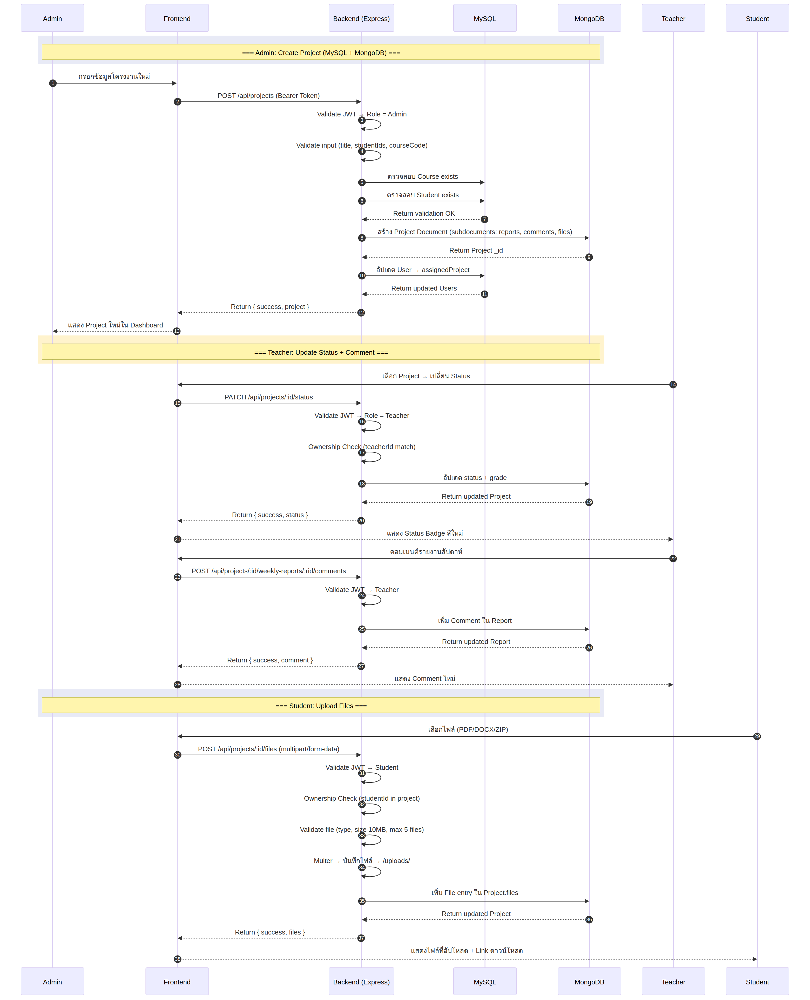
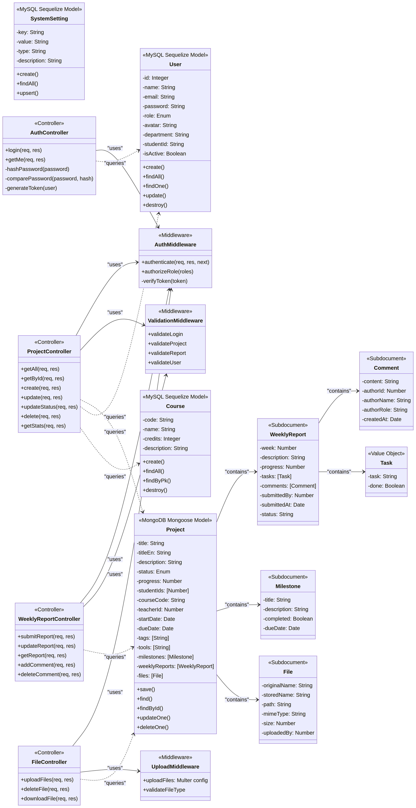
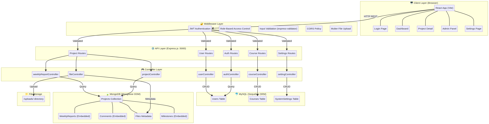
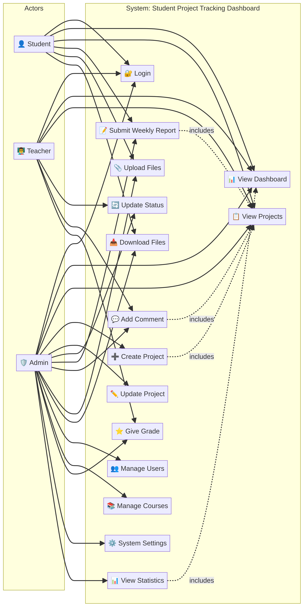
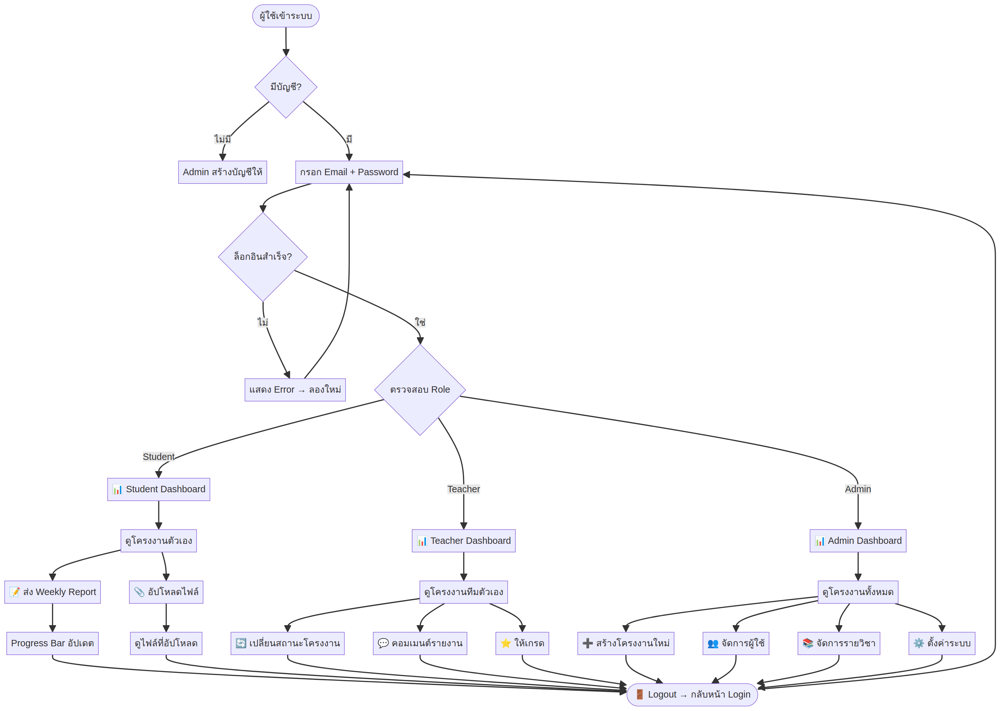
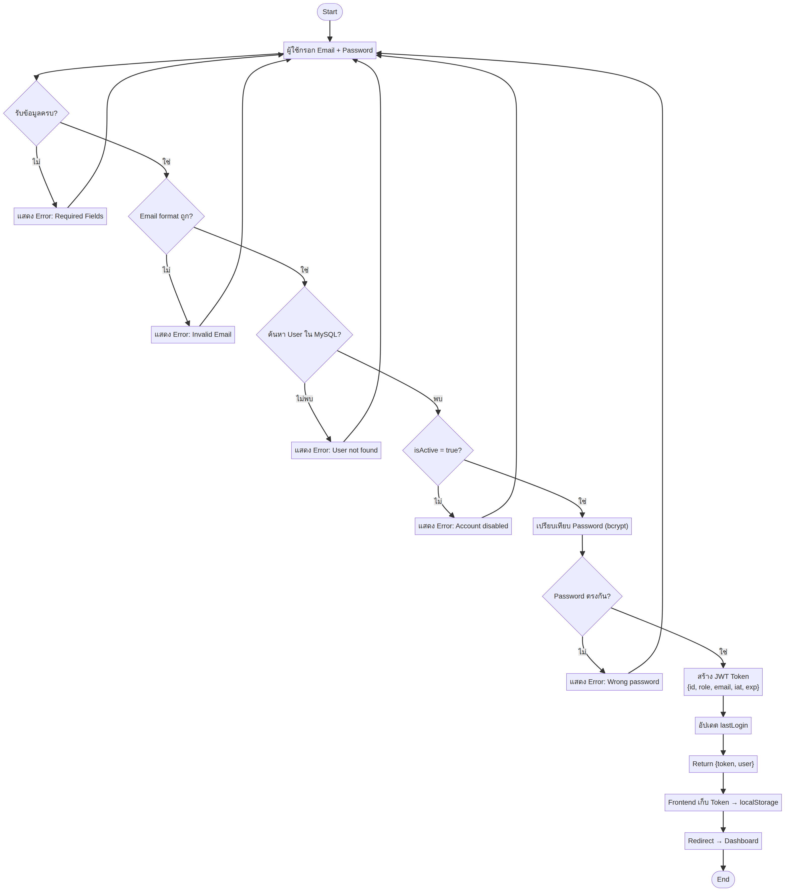
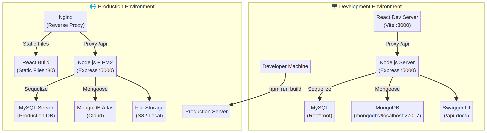

# Student Project Tracking Dashboard

> ระบบติดตามความคืบหน้าโครงงานนักศึกษา — Full-Stack Web Application

**Tech Stack:** React + Vite + TailwindCSS | Node.js + Express | MySQL + MongoDB

---

## 📋 สารบัญ

1. [ภาพรวมโปรเจค](#-ภาพรวมโปรเจค)
2. [สถาปัตยกรรมระบบ](#-สถาปัตยกรรมระบบ)
3. [Database Schema](#-database-schema)
4. [Sequence Diagram](#-sequence-diagram)
5. [Class Diagram](#-class-diagram)
6. [Additional Diagrams](#-additional-diagrams)
7. [API Endpoints](#-api-endpoints)
8. [วิธีติดตั้งและรัน](#-วิธีติดตั้งและรัน)
9. [บัญชีทดสอบ](#-บัญชีทดสอบ)
10. [โครงสร้างโฟลเดอร์](#-โครงสร้างโฟลเดอร์)

---

## 🎯 ภาพรวมโปรเจค

ระบบนี้สร้างขึ้นมาเพื่อแก้ปัญหาการติดตามโครงงานนักศึกษาที่อาจารย์ต้องตรวจหลายทีมพร้อมกัน โดยให้:

- **Dashboard Real-time** แสดงภาพรวมโครงงานทุกทีมพร้อม Progress Bar
- **Weekly Report** นักศึกษาอัปเดตความคืบหน้าทุกสัปดาห์ อาจารย์คอมเมนต์ได้
- **File Management** อัปโหลดไฟล์ส่งงานแบบรวมศูนย์
- **Multi-role Access** 3 บทบาท: Student, Teacher, Admin
- **Hybrid Database** ใช้ MySQL + MongoDB พร้อมกัน

---

## 🏗️ สถาปัตยกรรมระบบ

```
┌─────────────────────────────────────────────────────────────────┐
│                    CLIENT LAYER (Browser)                        │
│  React 18 + Vite + TailwindCSS + Material UI                   │
└──────────────────────┬──────────────────────────────────────────┘
                       │ HTTP REST (JWT Bearer Token)
┌──────────────────────▼──────────────────────────────────────────┐
│                  MIDDLEWARE LAYER                                │
│  JWT Auth | Role-Based Access | express-validator | Multer      │
└──────────────────────┬──────────────────────────────────────────┘
                       │
┌──────────────────────▼──────────────────────────────────────────┐
│                    API LAYER (Express.js :5000)                  │
│  Auth | Projects | Users | Courses | Settings                   │
└──────────────┬──────────────────────────┬───────────────────────┘
               │                          │
    ┌──────────▼──────────┐   ┌───────────▼──────────┐
    │  MySQL (Sequelize)  │   │  MongoDB (Mongoose)  │
    │  Users Table        │   │  Projects Collection  │
    │  Courses Table      │   │  WeeklyReports        │
    │  SystemSettings     │   │  Comments             │
    └─────────────────────┘   │  Files Metadata       │
                              └───────────────────────┘
```

---

## 🗄️ Database Schema

### MySQL (Sequelize ORM) — ข้อมูลที่มีโครงสร้างชัดเจน

| Table | Columns | คำอธิบาย |
|-------|---------|----------|
| **Users** | id (PK), name, email (UK), password (bcrypt), role (enum), avatar, department, studentId, isActive, lastLogin | เก็บข้อมูลผู้ใช้ 3 บทบาท |
| **Courses** | code (PK), name, credits, description | รายวิชา 10 วิชา |
| **SystemSettings** | key (PK), value, type, description | ตั้งค่าระบบ (ปีการศึกษา, เทอม, etc.) |

### MongoDB (Mongoose ODM) — ข้อมูล Flexible Schema

| Collection | Fields | คำอธิบาย |
|------------|--------|----------|
| **Projects** | _id, title, titleEn, description, status (enum), progress, studentIds[], courseCode, teacherId, startDate, dueDate, tags[], tools[], milestones[], weeklyReports[], files[] | โครงงานหลัก (embedded subdocuments) |
| **WeeklyReports** | (embedded in Project) week, description, progress, tasks[], comments[], submittedBy, submittedAt, status | รายงานสัปดาห์ (nested) |
| **Comments** | (embedded in Report) content, authorId, authorName, authorRole, createdAt | คอมเมนต์ของอาจารย์ |
| **Files** | (embedded in Project) originalName, storedName, path, mimeType, size, uploadedBy, uploadedAt | ไฟล์แนบ |

### ER Diagram



---

## 🔄 Sequence Diagram

### Authentication + Fetch Projects + Submit Report Flow



### CRUD Operations (Admin, Teacher, Student)



---

## 📦 Class Diagram



---

## 📊 Additional Diagrams

### Architecture Diagram



### Use Case Diagram



### User Flow Diagram



### Activity Diagram (Authentication)



### Deployment Diagram



---

## 📡 API Endpoints

| Method | Endpoint | Role | คำอธิบาย | DB |
|--------|----------|------|----------|-----|
| POST | `/api/auth/login` | All | ล็อกอิน รับ JWT Token | MySQL |
| GET | `/api/auth/me` | All | ดึงข้อมูลผู้ใช้ปัจจุบัน | MySQL |
| GET | `/api/projects` | All | ดึงโครงงาน (กรองตาม role) | MongoDB |
| GET | `/api/projects/stats` | All | สถิติ Dashboard | MongoDB |
| GET | `/api/projects/:id` | All | ดึงโครงงาน + Reports + Comments | MongoDB |
| POST | `/api/projects` | Admin | สร้างโครงงานใหม่ | MongoDB |
| PUT | `/api/projects/:id` | Admin, Teacher | แก้ไขโครงงาน | MongoDB |
| PATCH | `/api/projects/:id/status` | Teacher | เปลี่ยนสถานะ + ให้เกรด | MongoDB |
| DELETE | `/api/projects/:id` | Admin | ลบโครงงาน | MongoDB |
| POST | `/api/projects/:id/weekly-reports` | Student | ส่งรายงานสัปดาห์ | MongoDB |
| PUT | `/api/projects/:id/weekly-reports/:rid` | Student | แก้ไขรายงาน | MongoDB |
| POST | `/api/projects/:id/weekly-reports/:rid/comments` | Teacher | คอมเมนต์รายงาน | MongoDB |
| POST | `/api/projects/:id/files` | Student | อัปโหลดไฟล์ | MongoDB |
| DELETE | `/api/projects/:id/files/:fid` | Student | ลบไฟล์ | MongoDB |
| GET | `/api/users` | Admin | ดึงผู้ใช้ทั้งหมด | MySQL |
| GET | `/api/users/teachers` | Admin | ดึงรายชื่ออาจารย์ | MySQL |
| GET | `/api/users/students` | Admin | ดึงรายชื่อนักศึกษา | MySQL |
| POST | `/api/users` | Admin | สร้างผู้ใช้ใหม่ | MySQL |
| DELETE | `/api/users/:id` | Admin | ลบผู้ใช้ | MySQL |
| GET | `/api/courses` | All | ดึงรายวิชา | MySQL |
| POST | `/api/courses` | Admin | เพิ่มวิชา | MySQL |
| DELETE | `/api/courses/:code` | Admin | ลบวิชา | MySQL |
| GET | `/api/settings` | Admin | ดึงตั้งค่าระบบ | MySQL |
| PUT | `/api/settings/bulk` | Admin | แก้ไขตั้งค่าหลายค่า | MySQL |

> **Swagger API Docs:** เข้าไปดูได้ที่ `http://localhost:5000/api-docs`

---

## 🚀 วิธีติดตั้งและรัน

### ขั้นตอนที่ 1: ติดตั้งโปรแกรมที่ต้องใช้

| โปรแกรม | เวอร์ชันแนะนำ | ลิงก์ดาวน์โหลด |
|---|---|---|
| **Node.js** | 18+ | https://nodejs.org |
| **MySQL** | 8.0+ | https://dev.mysql.com/downloads |
| **MongoDB** | 7.0+ | https://www.mongodb.com/try/download/community |

### ขั้นตอนที่ 2: ติดตั้ง Dependencies

```bash
cd student-project-fullstack
npm install
cd server && npm install && cd ..
```

### ขั้นตอนที่ 3: ตั้งค่า MySQL

```sql
CREATE DATABASE student_project_db CHARACTER SET utf8mb4 COLLATE utf8mb4_unicode_ci;
```

### ขั้นตอนที่ 4: แก้ไขไฟล์ .env

```env
MYSQL_PASSWORD=your_password
MONGODB_URI=mongodb://localhost:27017/student_project_db
```

### ขั้นตอนที่ 5: ใส่ข้อมูลตัวอย่าง

```bash
cd server && node database/seed.js && cd ..
```

### ขั้นตอนที่ 6: รันระบบ

```bash
# Terminal 1 - Backend
cd server && npm run dev

# Terminal 2 - Frontend
npm run dev
```

เปิดเบราว์เซอร์ไปที่ **http://localhost:3000**

---

## 👤 บัญชีทดสอบ

| บทบาท | อีเมล | รหัสผ่าน |
|---|---|---|
| Student 1 | thanakorn.w@student.uni.ac.th | student123 |
| Student 2 | somsri.k@student.uni.ac.th | student123 |
| Student 3 | pravit.s@student.uni.ac.th | student123 |
| Teacher 1 | somchai.j@uni.ac.th | teacher123 |
| Teacher 2 | niran.p@uni.ac.th | teacher123 |
| Admin | admin@uni.ac.th | admin123 |

---

## 📁 โครงสร้างโฟลเดอร์

```
student-project-fullstack/
├── src/                          # Frontend (React + Vite)
│   ├── app/
│   │   ├── App.tsx               # Main App Component
│   │   └── components/
│   │       ├── Login.tsx         # หน้าล็อกอิน (เรียก API จริง)
│   │       ├── Dashboard.tsx     # หน้า Dashboard
│   │       ├── ProjectList.tsx   # รายการโครงงาน
│   │       ├── ProgressBar.tsx   # Progress Bar Component
│   │       ├── StatusBadge.tsx   # Status Badge
│   │       ├── WeeklyProgress.tsx # Weekly Report
│   │       ├── CreateProjectModal.tsx
│   │       ├── AdminView.tsx     # Admin Panel
│   │       ├── Sidebar.tsx       # Sidebar Navigation
│   │       └── data.ts           # Mock Data (fallback)
│   ├── styles/                   # TailwindCSS + Global Styles
│   └── main.tsx
├── server/                       # Backend (Node.js + Express)
│   ├── server.js                 # Express Server Entry
│   ├── controllers/              # Business Logic (7 files)
│   ├── routes/                   # API Routes (5 files)
│   ├── database/
│   │   ├── models/mysql/         # User, Course, SystemSetting
│   │   ├── models/mongodb/       # Project
│   │   ├── mysql/connection.js   # Sequelize Connection
│   │   ├── mongodb/connection.js # Mongoose Connection
│   │   └── seed.js               # Seed Data Script
│   ├── middleware/
│   │   ├── auth.js               # JWT Authentication
│   │   ├── validation.js         # express-validator
│   │   └── upload.js             # Multer File Upload
│   ├── config/
│   │   └── swagger.js            # Swagger/OpenAPI Config
│   ├── uploads/                  # File Storage
│   ├── .env                      # Environment Variables
│   └── package.json
├── diagrams/                     # 📊 Project Diagrams (9 diagrams)
│   ├── sequence_login_project.mmd
│   ├── sequence_login_project.png
│   ├── sequence_crud_operations.mmd
│   ├── sequence_crud_operations.png
│   ├── er_diagram.mmd
│   ├── er_diagram.png
│   ├── class_diagram.mmd
│   ├── class_diagram.png
│   ├── architecture_diagram.mmd
│   ├── architecture_diagram.png
│   ├── usecase_diagram.mmd
│   ├── usecase_diagram.png
│   ├── user_flow.mmd
│   ├── user_flow.png
│   ├── activity_auth.mmd
│   ├── activity_auth.png
│   ├── deployment_diagram.mmd
│   └── deployment_diagram.png
├── StudentProjectTracking-Postman.json  # Postman Collection
├── package.json                  # Frontend Dependencies
├── vite.config.ts                # Vite Config (Proxy → Backend)
└── README.md                     # 📖 คุณกำลังอ่านอยู่!
```

---

## 📦 Dependencies

### Frontend
| Package | Version |
|---------|---------|
| react | ^18.3.1 |
| react-dom | ^18.3.1 |
| vite | ^5.0.0 |
| tailwindcss | ^3.4.0 |
| @mui/material | ^5.15.0 |
| lucide-react | ^0.300.0 |

### Backend
| Package | Version | หน้าที่ |
|---------|---------|--------|
| express | ^4.18.2 | Web Framework |
| mongoose | ^8.1.1 | MongoDB ODM |
| sequelize | ^6.35.2 | MySQL ORM |
| mysql2 | ^3.7.0 | MySQL Driver |
| jsonwebtoken | ^9.0.2 | JWT Authentication |
| bcryptjs | ^2.4.3 | Password Hashing |
| express-validator | ^7.3.2 | Input Validation |
| multer | ^1.4.5 | File Upload |
| cors | ^2.8.5 | Cross-Origin |
| swagger-ui-express | ^5.0.0 | API Documentation |
| swagger-jsdoc | ^6.2.8 | OpenAPI Spec |

---

## 📄 License

MIT License

---

> **หมายเหตุ:** โปรเจคนี้ออกแบบมาเพื่อการศึกษา — ใช้ Hybrid Database (MySQL + MongoDB) เพื่อแสดงให้เห็นว่าทั้งสอง DB ทำงานร่วมกันได้อย่างไร โดย MySQL เก็บข้อมูลที่มีโครงสร้างชัดเจน (Users, Courses) และ MongoDB เก็บข้อมูลที่มี schema ยืดหยุ่น (Projects, Reports, Comments, Files)
